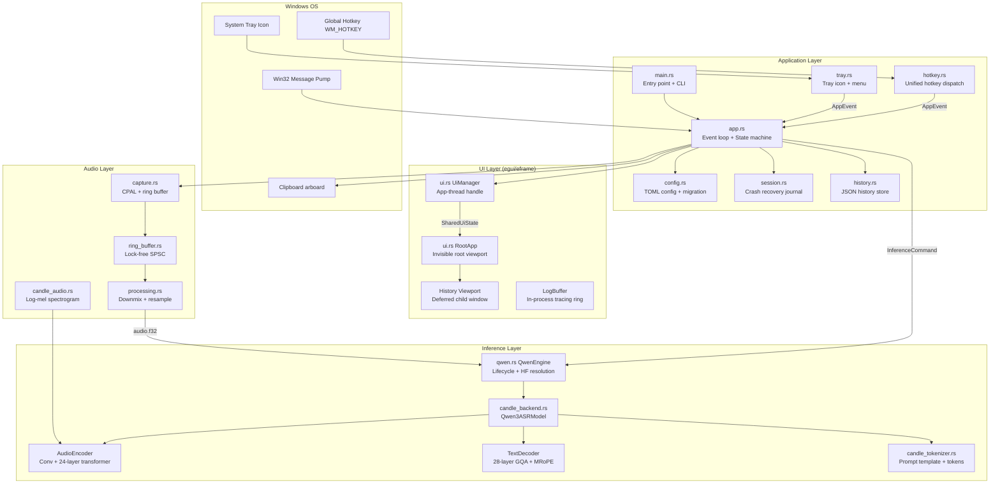
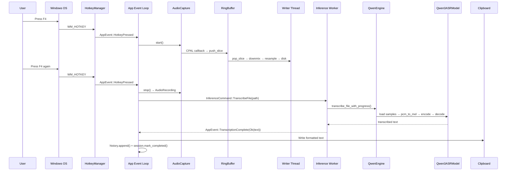
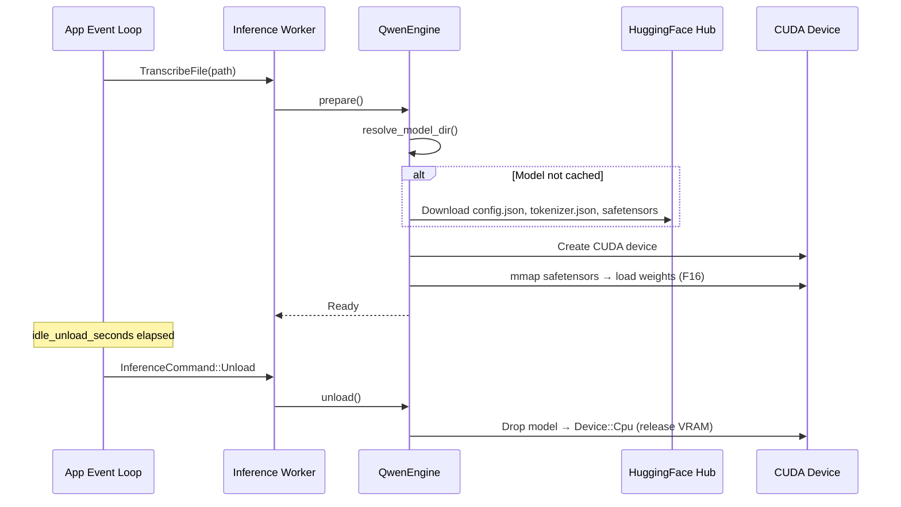

# Codebase Map

> Auto-generated by Cartographer. Last mapped: 2026-02-28

## System Overview



## Directory Structure

```
Voclaude/
├── src/
│   ├── main.rs              # Entry point, CLI args, logging init
│   ├── app.rs               # Event loop, state machine, inference worker
│   ├── ui.rs                # Multi-viewport egui (invisible root + history)
│   ├── config.rs            # TOML config, validation, legacy migration
│   ├── hotkey.rs            # Global hotkey registration, unified listener
│   ├── tray.rs              # System tray icon, context menu, state icons
│   ├── session.rs           # Crash-recovery session journal (JSON)
│   ├── history.rs           # Persistent transcription history (JSON)
│   ├── audio/
│   │   ├── mod.rs           # Re-exports: AudioCapture, processing, RingBuffer
│   │   ├── capture.rs       # CPAL audio capture, writer thread, level meter
│   │   ├── processing.rs    # Mono downmix, linear resampler (streaming)
│   │   └── ring_buffer.rs   # Lock-free SPSC ring buffer (power-of-2)
│   └── inference/
│       ├── mod.rs            # AsrEngine trait, InferenceProgress, re-exports
│       ├── candle_backend.rs # Full Qwen3-ASR-1.7B model (encoder+decoder+MRoPE)
│       ├── candle_audio.rs   # PCM → 128-bin log-mel spectrogram (Whisper-compat)
│       ├── candle_tokenizer.rs # HF tokenizer wrapper, ASR prompt template
│       └── qwen.rs           # QwenEngine lifecycle (load/unload/HF resolution)
├── assets/                   # PNG icons for tray states (idle/recording/processing)
├── docs/
│   └── qwen3_asr_integration_plan.md
├── Cargo.toml                # Manifest: cuda/cpu features, release LTO
├── build.rs                  # Git hash embedding at compile time
├── config.example.toml       # Reference config for distribution
├── package.ps1               # PowerShell packaging: build + CUDA DLLs + zip
├── README.md                 # User docs, build instructions, architecture
└── PLAN.md                   # Engineering plan: 4-phase production hardening
```

## Module Guide

### Application Core (`src/app.rs`)

**Purpose**: Main event loop, state machine (Idle/Recording/Transcribing), inference worker lifecycle, transcript formatting, session recovery, and watchdog.

**Key files**:

| File | Purpose | Tokens |
|------|---------|--------|
| `src/app.rs` | Event loop, state machine, inference worker | 7,698 |
| `src/main.rs` | CLI args, logging init, app dispatch | 2,193 |

**Key types**: `App`, `AppState` (Idle/Recording/Transcribing), `AppEvent`, `InferenceCommand`, `NotificationManager`

**State machine**:
```
Idle ──[HotkeyPressed]──► Recording ──[HotkeyPressed]──► Transcribing ──[Complete]──► Idle
```

**Channels**:
- `event_tx/rx` (unbounded) — all inter-component events
- `inference_cmd_tx/rx` (bounded 8) — commands to inference worker
- `level_tx/rx` (bounded 64) — audio level meter
- `history_update_tx/rx` (bounded 32) — new history entries

**Thread inventory**:

| Thread | Owner | Role |
|--------|-------|------|
| Main | OS | Win32 message pump + event loop |
| Inference worker | `spawn_inference_worker()` | Owns QwenEngine, processes commands |
| Hotkey listener | `HotkeyManager` | Dispatches global hotkey events |
| Tray menu | `TrayManager` | Dispatches menu click events |
| egui/eframe | `UiManager` | Renders UI viewports |
| Keepalive | `UiManager` | Repaint poke every 100ms |
| Settings watcher | Ad-hoc | Polls config mtime on change |

**Dependencies**: All other modules
**Dependents**: `main.rs`

---

### Configuration (`src/config.rs`)

**Purpose**: TOML config loading, saving with atomic write-temp-rename, field validation, and legacy migration from `VoclaudeQwenRuntime`.

| File | Purpose | Tokens |
|------|---------|--------|
| `src/config.rs` | Config struct, load/save/validate/migrate | 3,017 |
| `config.example.toml` | Reference config for users | 252 |

**Key types**: `Config` (flat struct, all pub fields, serde defaults + aliases)

**Config path**: `%APPDATA%\voclaude\Voclaude\config\config.toml`

**Patterns**:
- Every field has `#[serde(default)]` — partial TOML files work
- Legacy aliases: `qwen_model` → `model_id`, `qwen_model_path` → `model_path`, etc.
- Atomic save: write `.toml.tmp` → `sync_all()` → rename (5 retries for AV locks)
- Migration: copies from `VoclaudeQwenRuntime` directory once, validates after copy

**Dependencies**: `directories`, `serde`, `toml`
**Dependents**: `app.rs`, `main.rs`, `qwen.rs`, `session.rs`, `history.rs`

---

### Hotkey System (`src/hotkey.rs`)

**Purpose**: Global hotkey registration and unified dispatch — single listener thread for all hotkeys to prevent `GlobalHotKeyEvent` receiver contention.

| File | Purpose | Tokens |
|------|---------|--------|
| `src/hotkey.rs` | Hotkey registration, debounce, dispatch | 2,482 |

**Key types**: `HotkeyManager`

**Patterns**:
- Single listener thread reads all events, dispatches by hotkey ID via HashMap
- 150ms per-ID debounce prevents double-fire
- Only `HotKeyState::Pressed` forwarded (Released discarded)
- `Drop` sets shutdown flag + unregisters all hotkeys

**Dependencies**: `global_hotkey`, `crossbeam_channel`
**Dependents**: `app.rs`

---

### System Tray (`src/tray.rs`)

**Purpose**: System tray icon with 3 states (Idle/Recording/Processing), context menu, menu event dispatch thread.

| File | Purpose | Tokens |
|------|---------|--------|
| `src/tray.rs` | Tray icon, menu, state-dependent icons | 1,998 |

**Key types**: `TrayManager`, `CachedIcon`

**Patterns**:
- 3 PNG icons embedded via `include_bytes!`, decoded once at construction
- Menu event thread polls `MenuEvent::receiver()` with 200ms timeout
- Toggle menu item disabled during Transcribing state

**Dependencies**: `tray_icon`, `image`, `crossbeam_channel`
**Dependents**: `app.rs`

---

### UI Layer (`src/ui.rs`)

**Purpose**: egui multi-viewport UI — invisible root viewport hosting a deferred History child window, plus in-process `LogBuffer` for tracing.

| File | Purpose | Tokens |
|------|---------|--------|
| `src/ui.rs` | UiManager, RootApp, History viewport, LogBuffer | 5,726 |

**Key types**: `LogBuffer`, `UiStatus`, `SharedUiState`, `UiManager`, `RootApp`

**Viewport architecture**:
```
eframe thread ─── RootApp.update() [invisible 1×1 root, no taskbar]
    └── ctx.show_viewport_deferred("voclaude_history") ─── History window
```

**Patterns**:
- Root viewport: 1×1 px, invisible, no decorations, intercepts close (CancelClose)
- Keepalive thread pokes `request_repaint()` every 100ms
- `viewport_alive` AtomicBool gates focus commands until first paint
- `SharedUiState` is all-Arc, lock-poison tolerant

**Dependencies**: `eframe`, `winit`, `arboard`, `windows_sys`
**Dependents**: `app.rs`

---

### Session Recovery (`src/session.rs`)

**Purpose**: Crash-recovery journal — records session state transitions to `session.json`, enabling recovery of in-flight recordings after unexpected shutdown.

| File | Purpose | Tokens |
|------|---------|--------|
| `src/session.rs` | SessionStore, RecordingSession, state persistence | 1,527 |

**Key types**: `SessionState` (Recording/Transcribing/Completed/Failed/Aborted), `RecordingSession`, `SessionStore`

**Patterns**:
- Each state transition persists immediately via atomic write
- `is_recoverable()` returns true for Recording/Transcribing
- Corrupt files backed up as `session.json.corrupt-{ts}`
- Session ID: `"{timestamp_ms}-{counter}"`

**Dependencies**: `serde_json`, `history::AudioMetadata`
**Dependents**: `app.rs`

---

### History Store (`src/history.rs`)

**Purpose**: Persistent append-only transcription history — JSON array with retention pruning, corrupt-file recovery, and UI notification channel.

| File | Purpose | Tokens |
|------|---------|--------|
| `src/history.rs` | HistoryStore, HistoryEntry, retention, recovery | 2,047 |

**Key types**: `AudioMetadata`, `HistoryEntry`, `HistoryStore`

**Patterns**:
- Retention prunes oldest entries on load and append, rewrites entire file
- `recover_entries()` — custom brace-depth JSON parser for corrupt files
- `try_send()` to bounded(32) channel — drops silently if full
- Atomic write same as config/session

**Dependencies**: `serde_json`, `crossbeam_channel`
**Dependents**: `app.rs`, `session.rs`

---

### Audio Capture (`src/audio/`)

**Purpose**: CPAL-based audio pipeline — capture from default device, lock-free ring buffer, mono downmix, linear resample to 16 kHz, write raw F32 to disk.

| File | Purpose | Tokens |
|------|---------|--------|
| `src/audio/capture.rs` | CPAL stream, writer thread, level meter | 3,155 |
| `src/audio/processing.rs` | Mono downmix, streaming linear resampler | 1,101 |
| `src/audio/ring_buffer.rs` | Lock-free SPSC ring buffer (power-of-2) | 763 |
| `src/audio/mod.rs` | Re-exports | 52 |

**Pipeline**:
```
CPAL callback → RingBuffer (SPSC) → Writer thread → mono_from_interleaved → LinearResampler → audio.f32
```

**Key types**: `AudioCapture`, `AudioRecording`, `RingBuffer`, `LinearResampler`

**Patterns**:
- SPSC ring buffer: Relaxed/Release/Acquire ordering, no mutex in hot path
- Writer thread: 4096-sample chunks, 2ms idle sleep, level meter at 60ms intervals
- Device config selection: prefers mono@16kHz, falls back to resample
- Ring buffer overflow tracked via `AtomicUsize` dropped sample counter

**Dependencies**: `cpal`, `crossbeam_channel`
**Dependents**: `app.rs`

---

### Inference Engine (`src/inference/`)

**Purpose**: Qwen3-ASR-1.7B implementation via Candle 0.9 — model loading, audio encoding, text decoding with MRoPE/GQA, and engine lifecycle management.

| File | Purpose | Tokens |
|------|---------|--------|
| `src/inference/candle_backend.rs` | Full model: AudioEncoder + TextDecoder + MRoPE | 11,738 |
| `src/inference/qwen.rs` | QwenEngine lifecycle, HF model resolution | 3,273 |
| `src/inference/candle_audio.rs` | PCM → log-mel spectrogram (Whisper-compat) | 2,131 |
| `src/inference/candle_tokenizer.rs` | HF tokenizer wrapper, ASR prompt template | 1,247 |
| `src/inference/mod.rs` | AsrEngine trait, InferenceProgress | 312 |

**Model architecture (Qwen3-ASR-1.7B)**:

| Component | Params |
|-----------|--------|
| AudioEncoder | 3× stride-2 Conv2d → 24 transformer layers, d_model=1024, 16 heads |
| TextDecoder | 28 layers, hidden=2048, 16Q/8KV heads (GQA 2:1), head_dim=128 |
| MRoPE | sections=[24,20,20], rope_theta=1M, precomputed 4096 positions |
| FFN | SwiGLU, intermediate=6144, no bias |
| Vocab | 151,936 tokens |

**Key types**: `Qwen3ASRModel`, `AudioEncoder`, `TextDecoder`, `MRoPEEmbedding`, `DecoderAttention`, `QwenEngine`, `Qwen3ASRTokenizer`, `AsrEngine` (trait)

**Model resolution order**:
1. Explicit `config.model_path` directory
2. HuggingFace disk cache (most recent snapshot with `config.json`)
3. HuggingFace download via `hf_hub`

**Lifecycle**:
```
new_with_config() → prepare() [lazy load model+tokenizer] → transcribe() → unload() [drop model, reset CUDA]
```

**Patterns**:
- `CacheGuard` RAII ensures KV cache cleanup on all exit paths
- Staged memory release: mel/encoder tensors scoped to drop before decode
- Greedy argmax decoding (no beam search, no temperature)
- MRoPE cos/sin precomputed on GPU at load time — no CPU round-trip during decode
- Windowed audio encoding: 100-frame chunks, 104-token transformer windows

**Dependencies**: `candle_core`, `candle_nn`, `hf_hub`, `tokenizers`, `realfft`, `half`
**Dependents**: `app.rs`

---

## Data Flow

### Recording → Transcription → Clipboard



### Model Load / Unload Lifecycle



## Conventions

- **Atomic writes everywhere**: config, session, history all use write-temp-rename with retry for Windows AV locks
- **Channel-based communication**: crossbeam unbounded for events, bounded for commands/updates
- **Serde defaults + aliases**: all config fields have defaults; legacy field names preserved via `#[serde(alias)]`
- **Entry IDs**: `"{timestamp_ms}-{counter}"` pattern used for both session and history IDs
- **Tracing**: structured logging via `tracing` crate with file + in-process ring buffer sinks
- **RAII cleanup**: `CacheGuard` for KV cache, `Drop` impls on `HotkeyManager` and `TrayManager`
- **No shared mutable state**: inference worker owns engine exclusively; UI communicates via Arc+Mutex snapshots
- **BUG comments**: inline `BUG N:` markers document fixed bugs in candle_backend.rs

## Gotchas

### Performance
- **KV cache O(N^2)**: `Tensor::cat` per decode step; Candle 0.9 lacks in-place `slice_set`. Acceptable for ASR (~50-200 tokens) but wasteful.
- **Mel filterbank recomputed every call**: `compute_mel_filterbank()` is not cached (negligible cost but pure waste).
- **STFT runs on CPU**: `realfft` is CPU-only; mel spectrogram involves a CPU→GPU transfer each transcription.
- **Token argmax forces GPU→CPU sync**: `to_scalar::<u32>()` per decode step — one synchronization per generated token.
- **`max_new_tokens` config ignored**: hard-coded to 2048 in `candle_backend.rs:972`; the config field has no effect.

### Correctness
- **WAV loader assumes 16-bit PCM**: format/bits fields are logged but never validated. Non-PCM WAVs produce silent garbage.
- **Hardcoded special token IDs**: not validated against loaded tokenizer vocabulary at runtime.
- **`_language` parameter unused**: language-conditional transcription prompts are not implemented.
- **History brace-depth recovery**: cannot handle unbalanced `{`/`}` inside JSON string values.

### Windows-Specific
- **Unsafe mmap**: `VarBuilder::from_mmaped_safetensors` locks the model files on disk — cannot replace while loaded.
- **CUDA default feature**: `cargo build` without `--no-default-features` requires CUDA Toolkit.
- **Console-less GUI**: `MessageBoxW` used for fatal errors since Windows GUI subsystem has no stdout.
- **`eframe`/`winit` version lock**: eframe 0.27 requires winit 0.29; bumping one without the other breaks the build.

### UI Race Conditions
- **History viewport close race**: `show_viewport_deferred` close events only fire during active repaints; 200ms repaint timer mitigates but doesn't eliminate.
- **Keepalive required**: without the 100ms repaint poke, egui stops repainting idle windows and events are missed.

## Navigation Guide

**To add a new hotkey action**:
1. Add variant to `AppEvent` in `src/app.rs`
2. Register binding in `src/app.rs` where `HotkeyManager::new_multi` is called
3. Handle the new event in the match block of `run_event_loop()`

**To add a new tray menu item**:
1. Add menu item in `TrayManager::new()` in `src/tray.rs`
2. Add match arm in the menu event dispatch thread
3. Handle the resulting `AppEvent` in `src/app.rs`

**To modify the inference pipeline**:
1. Model architecture: `src/inference/candle_backend.rs`
2. Mel spectrogram: `src/inference/candle_audio.rs`
3. Prompt template / tokenizer: `src/inference/candle_tokenizer.rs`
4. Engine lifecycle / model loading: `src/inference/qwen.rs`
5. `AsrEngine` trait: `src/inference/mod.rs`

**To add a new config field**:
1. Add field with `#[serde(default = "fn")]` to `Config` in `src/config.rs`
2. Add validation in `Config::validate()`
3. Update `config.example.toml`
4. Wire into consumers (app.rs, qwen.rs, etc.)

**To modify the audio pipeline**:
1. Capture: `src/audio/capture.rs` (CPAL stream, device selection)
2. Processing: `src/audio/processing.rs` (downmix, resample)
3. Ring buffer: `src/audio/ring_buffer.rs` (capacity, SPSC logic)

**To add a new UI panel/viewport**:
1. Add shared state fields to `SharedUiState` in `src/ui.rs`
2. Add control methods to `UiManager`
3. Add viewport rendering in `RootApp::update()` using `show_viewport_deferred`

**To build and package**:
- Debug: `cargo build`
- Release (GPU): `cargo build --release`
- Release (CPU): `cargo build --release --no-default-features --features cpu`
- Package: `powershell -File package.ps1` (bundles CUDA DLLs + zip)
